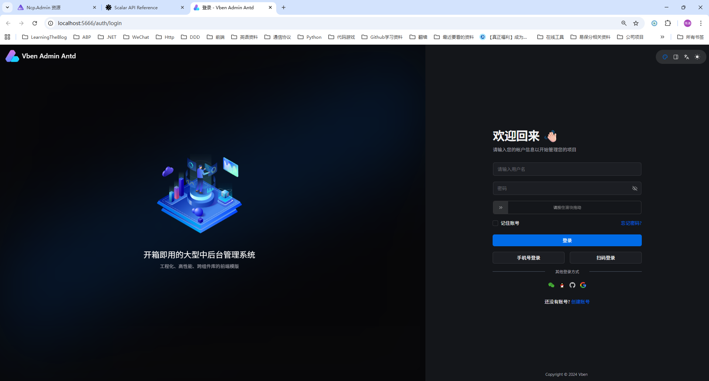
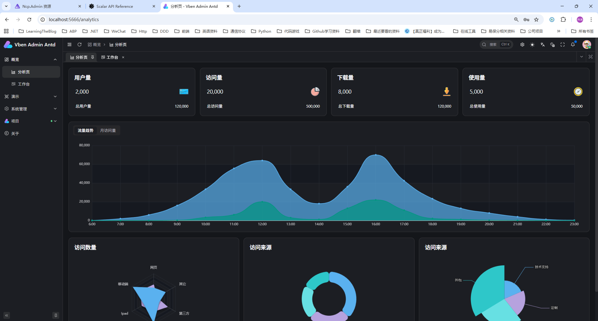
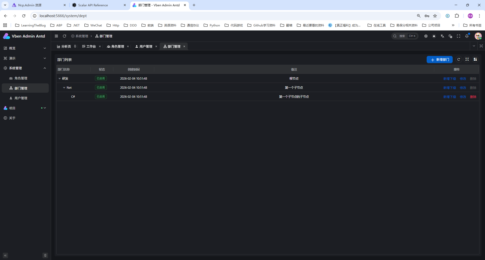
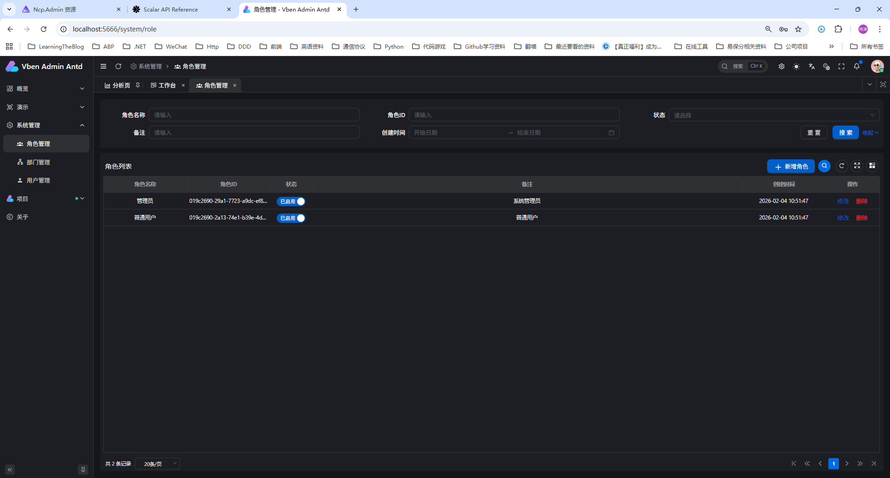
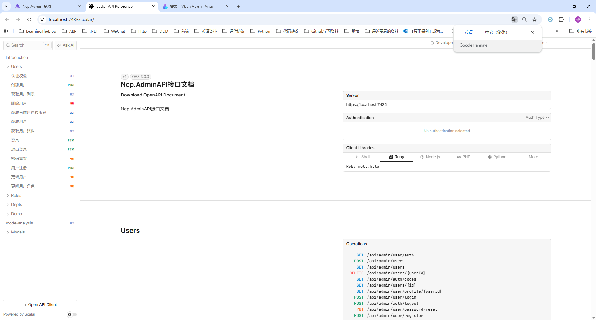

# Ncp.Admin

基于 [NetCorePal Cloud Framework](https://github.com/netcorepal/netcorepal-cloud-framework) 的 **平台脚手架**：IAM（用户/角色/部门/岗位）+ 工作流引擎 + 平台基础设施（通知、日志、文件、首页），后端 ASP.NET Core + DDD，前端 [Vben Admin](https://github.com/vbenjs/vue-vben-admin)（Vue 3 + Vite + TypeScript + Ant Design Vue）。

> **说明**：本分支已移除原 CRM / 行政 OA 等业务模块。扩展业务时请参考 Git 历史中的完整版实现。

### 默认管理员（空库首次启动自动种子）

| 项 | 值 |
|---|---|
| 用户名 | `admin` |
| 密码 | `Admin@123456` |

生产环境请立即修改密码。数据库使用单条基线迁移 `InitPlatform`（与旧业务库不兼容，请新建库）。

---

## 项目预览

以下为前端管理界面效果图。

**登录页**



**仪表盘 / 数据分析**



**部门管理**



**角色管理**



**API 文档（Scalar）**



---

## 环境准备

### 使用 Aspire（推荐）

项目启用了 Aspire 支持，只需要 Docker 环境即可，无需手动配置各种基础设施服务。

```bash
# 仅需确保 Docker 环境运行
docker version

# 直接运行 AppHost 项目，Aspire 会自动管理所有依赖服务
cd src/Ncp.Admin.AppHost
dotnet run
```

Aspire 会自动为您：
- 启动和管理数据库容器（本模板使用 **PostgreSQL**）
- 启动和管理消息队列容器（RabbitMQ、Kafka、NATS 等）
- 启动和管理 Redis 容器
- 提供统一的 Aspire Dashboard 界面查看所有服务状态
- 自动配置服务间的连接字符串和依赖关系

访问 Aspire Dashboard（通常在 http://localhost:15888）可以查看和管理所有服务。

### 推荐方式：使用初始化脚本（不使用 Aspire 时）

如果您没有启用 Aspire，项目提供了完整的基础设施初始化脚本，支持快速搭建开发环境：

#### 使用 Docker Compose（推荐）
```bash
# 进入脚本目录
cd scripts

# 启动默认基础设施 (PostgreSQL + Redis + RabbitMQ，本模板推荐)
docker-compose --profile postgres up -d

# 仅 Redis + RabbitMQ，使用 MySQL 作为数据库（需自行改回连接串等配置）
docker-compose up -d

# 使用 SQL Server 替代 PostgreSQL
docker-compose --profile sqlserver up -d

# 使用 Kafka 替代 RabbitMQ
docker-compose --profile kafka up -d

# 停止所有服务
docker-compose down

# 停止并删除数据卷（完全清理）
docker-compose down -v
```

#### 使用初始化脚本
```bash
# Linux/macOS
cd scripts
./init-infrastructure.sh

# Windows PowerShell
cd scripts
.\init-infrastructure.ps1

# 清理环境
./clean-infrastructure.sh        # Linux/macOS
.\clean-infrastructure.ps1       # Windows
```

### 手动方式：单独运行 Docker 容器

如果需要手动控制每个容器，可以使用以下命令：

```bash
# Redis
docker run --restart unless-stopped --name netcorepal-redis -p 6379:6379 -v netcorepal_redis_data:/data -d redis:7.2-alpine redis-server --appendonly yes --databases 1024

# PostgreSQL（本模板默认数据库）
docker run --restart unless-stopped --name netcorepal-postgres -p 5432:5432 -e POSTGRES_PASSWORD=123456 -e TZ=Asia/Shanghai -v netcorepal_postgres_data:/var/lib/postgresql/data -d postgres:16-alpine

# RabbitMQ
docker run --restart unless-stopped --name netcorepal-rabbitmq -p 5672:5672 -p 15672:15672 -e RABBITMQ_DEFAULT_USER=guest -e RABBITMQ_DEFAULT_PASS=guest -v netcorepal_rabbitmq_data:/var/lib/rabbitmq -d rabbitmq:3.12-management-alpine
```

### 服务访问信息

启动后，可以通过以下地址访问各个服务：

- **前端应用**: http://localhost:5666/
- **API 文档 (Scalar)**: http://localhost:5511/scalar（后端启动后访问）
- **Redis**: `localhost:6379`
- **PostgreSQL**: `localhost:5432` (postgres/123456)（本模板默认数据库）
- **RabbitMQ AMQP**: `localhost:5672` (guest/guest)
- **RabbitMQ 管理界面**: http://localhost:15672 (guest/guest)
- **SQL Server**: `localhost:1433` (sa/Test123456!)（可选 profile）
- **MySQL**: `localhost:3306` (root/123456)（可选 profile）
- **Kafka**: `localhost:9092`
- **Kafka UI**: http://localhost:8080

## 前端项目启动

前端基于 [Vben Admin](https://github.com/vbenjs/vue-vben-admin)，使用 Vue 3 + Vite + TypeScript + Ant Design Vue。界面效果见上方 **项目预览**。

### 环境要求

- **Node.js**: >= 20.12.0
- **pnpm**: >= 10.0.0

### 安装依赖

```bash
# 进入前端目录
cd src/frontend

# 安装依赖
npm i -g corepack
pnpm install
```

### 启动开发服务器

```bash
# 在 frontend 目录下执行
pnpm dev:antd
```

启动成功后，前端应用将在 **http://localhost:5666** 运行。

### 构建生产版本

```bash
# 在 frontend 目录下执行
pnpm build:antd
```

构建产物将输出到 `frontend/apps/admin-antd/dist` 目录。

### 其他常用命令

```bash
# 代码检查
pnpm lint

# 代码格式化
pnpm format

# 类型检查
pnpm check:type

# 预览构建结果
pnpm preview
```

### 环境变量配置

前端项目的环境变量配置文件位于 `frontend/apps/admin-antd/.env.development`：

- `VITE_PORT`: 开发服务器端口（默认：5666）
- `VITE_GLOB_API_URL`: 后端 API 地址（默认：http://localhost:5511/api）
- `VITE_NITRO_MOCK`: 是否开启 Mock 服务（默认：false）

## IDE 代码片段配置

本模板提供了丰富的代码片段，帮助您快速生成常用的代码结构。

### Visual Studio 配置

运行以下 PowerShell 命令自动安装代码片段：

```powershell
cd vs-snippets
.\Install-VSSnippets.ps1
```

或者手动安装：

1. 打开 Visual Studio
2. 转到 `工具` > `代码片段管理器`
3. 导入 `vs-snippets/NetCorePalTemplates.snippet` 文件

### VS Code 配置

VS Code 的代码片段已预配置在 `.vscode/csharp.code-snippets` 文件中，打开项目时自动生效。

### JetBrains Rider 配置

Rider 用户可以直接使用 `Ncp.Admin.sln.DotSettings` 文件中的 Live Templates 配置。

### 可用的代码片段

#### NetCorePal (ncp) 快捷键
| 快捷键 | 描述 | 生成内容 |
|--------|------|----------|
| `ncpcmd` | NetCorePal 命令 | ICommand 实现(含验证器和处理器) |
| `ncpcmdres` | 命令(含返回值) | ICommand&lt;Response&gt; 实现 |
| `ncpar` | 聚合根 | Entity&lt;Id&gt; 和 IAggregateRoot |
| `ncprepo` | NetCorePal 仓储 | IRepository 接口和实现 |
| `ncpie` | 集成事件 | IntegrationEvent 和处理器 |
| `ncpdeh` | 域事件处理器 | IDomainEventHandler 实现 |
| `ncpiec` | 集成事件转换器 | IIntegrationEventConverter |
| `ncpde` | 域事件 | IDomainEvent 记录 |

#### Endpoint (ep) 快捷键
| 快捷键 | 描述 | 生成内容 |
|--------|------|----------|
| `epp` | FastEndpoint(NCP风格) | 完整的垂直切片实现 |
| `epreq` | 仅请求端点 | Endpoint&lt;Request&gt; |
| `epres` | 仅响应端点 | EndpointWithoutRequest&lt;Response&gt; |
| `epdto` | 端点 DTOs | Request 和 Response 类 |
| `epval` | 端点验证器 | Validator&lt;Request&gt; |
| `epmap` | 端点映射器 | Mapper&lt;Request, Response, Entity&gt; |
| `epfull` | 完整端点切片 | 带映射器的完整实现 |
| `epsum` | 端点摘要 | Summary&lt;Endpoint, Request&gt; |
| `epnoreq` | 无请求端点 | EndpointWithoutRequest |
| `epreqres` | 请求响应端点 | Endpoint&lt;Request, Response&gt; |
| `epdat` | 端点数据 | 静态数据类 |

更多详细配置请参考：[vs-snippets/README.md](vs-snippets/README.md)

## 依赖与框架

+ [NetCorePal Cloud Framework](https://github.com/netcorepal/netcorepal-cloud-framework)
+ [ASP.NET Core](https://github.com/dotnet/aspnetcore)
+ [EFCore](https://github.com/dotnet/efcore)
+ [CAP](https://github.com/dotnetcore/CAP)
+ [MediatR](https://github.com/jbogard/MediatR)
+ [FluentValidation](https://docs.fluentvalidation.net/en/latest)
+ [Swashbuckle.AspNetCore.Swagger](https://github.com/domaindrivendev/Swashbuckle.AspNetCore)

## 数据库迁移

本模板使用 **PostgreSQL**。请确保 `appsettings.json` 或环境中的 `ConnectionStrings:PostgreSQL` 已配置为有效的连接串（使用 Aspire 时由 AppHost 自动注入）。

```shell
# 安装工具  SEE： https://learn.microsoft.com/zh-cn/ef/core/cli/dotnet#installing-the-tools
dotnet tool install --global dotnet-ef --version 9.0.0

# 更新数据库（需指定启动项目以加载连接串）
dotnet ef database update -p src/Ncp.Admin.Infrastructure -s src/Ncp.Admin.Web

# 创建迁移 SEE：https://learn.microsoft.com/zh-cn/ef/core/managing-schemas/migrations/?tabs=dotnet-core-cli
dotnet ef migrations add YourMigrationName -p src/Ncp.Admin.Infrastructure -s src/Ncp.Admin.Web
```

## 代码分析可视化

框架提供了强大的代码流分析和可视化功能，帮助开发者直观地理解DDD架构中的组件关系和数据流向。

### 🎯 核心特性

+ **自动代码分析**：通过源生成器自动分析代码结构，识别控制器、命令、聚合根、事件等组件
+ **多种图表类型**：支持架构流程图、命令链路图、事件流程图、类图等多种可视化图表
+ **交互式HTML可视化**：生成完整的交互式HTML页面，内置导航和图表预览功能
+ **一键在线编辑**：集成"View in Mermaid Live"按钮，支持一键跳转到在线编辑器

### 🚀 快速开始

安装命令行工具来生成独立的HTML文件：

```bash
# 安装全局工具
dotnet tool install -g NetCorePal.Extensions.CodeAnalysis.Tools

# 进入项目目录并生成可视化文件
cd src/Ncp.Admin.Web
netcorepal-codeanalysis generate --output architecture.html
```

### ✨ 主要功能

+ **交互式HTML页面**：
  + 左侧树形导航，支持不同图表类型切换
  + 内置Mermaid.js实时渲染
  + 响应式设计，适配不同设备
  + 专业的现代化界面

+ **一键在线编辑**：
  + 每个图表右上角的"View in Mermaid Live"按钮
  + 智能压缩算法优化URL长度
  + 自动跳转到[Mermaid Live Editor](https://mermaid.live/)
  + 支持在线编辑、导出图片、生成分享链接

### 📖 详细文档

完整的使用说明和示例请参考：

+ [代码流分析文档](https://netcorepal.github.io/netcorepal-cloud-framework/zh/code-analysis/code-flow-analysis/)
+ [代码分析工具文档](https://netcorepal.github.io/netcorepal-cloud-framework/zh/code-analysis/code-analysis-tools/)

## 关于监控

这里使用了`prometheus-net`作为与基础设施prometheus集成的监控方案，默认通过地址 `/metrics` 输出监控指标。

更多信息请参见：[https://github.com/prometheus-net/prometheus-net](https://github.com/prometheus-net/prometheus-net)

## Cursor 提示词示例（可复制）

在 Cursor 输入框输入 **`/`**，从列表选择本仓库 [`.cursor/skills/`](.cursor/skills/) 下的技能（如 `cleanddd-requirements-analysis`），**在同一条消息里**写清任务与上下文。需要叠加仓库约定时，再 **`@`** [`.cursor/rules/project-conventions.mdc`](.cursor/rules/project-conventions.mdc) 或 [`.cursor/rules/frontend-vben.mdc`](.cursor/rules/frontend-vben.mdc)。

### `.cursor/skills` 选用指南（`/ ` 里该点哪个）

| 技能 | 路径 | 用来做什么 | 典型使用时机 |
|------|------|------------|--------------|
| **cleanddd-requirements-analysis** | [SKILL.md](.cursor/skills/cleanddd-requirements-analysis/SKILL.md) | 把业务需求拆成结构化描述（干系人、条目、归属对象），**不直接建模** | 有新功能/改需求，需要先澄清「做什么」 |
| **cleanddd-modeling** | [SKILL.md](.cursor/skills/cleanddd-modeling/SKILL.md) | 产出聚合、命令、查询、事件、Endpoints 等 **建模蓝图** | 需求已清楚，要定边界与接口形态再写代码 |
| **cleanddd-dotnet-coding** | [SKILL.md](.cursor/skills/cleanddd-dotnet-coding/SKILL.md) | 在 **本仓库** 落地 Domain / Infrastructure / Web（命令、查询、端点、配置、测试） | 按建模补代码、改后端、审 DDD 分层 |
| **cleanddd-coach** | [SKILL.md](.cursor/skills/cleanddd-coach/SKILL.md) | **学习与陪练**：聚合边界、CQRS、事件、反模式（微课/小测/清单） | 想理解概念、团队对齐术语，而非立刻写功能 |
| **ncp-admin-frontend** | [SKILL.md](.cursor/skills/ncp-admin-frontend/SKILL.md) | **Vben Admin 前端**（Vue3 + Ant Design）：页面、API、路由、国际化、权限对齐 | 改 `src/frontend/apps/admin-antd` 或对接后端权限码 |

**记忆口诀**：先 **requirements** 澄清 → **modeling** 画蓝图 → **dotnet-coding** 写后端；前端找 **ncp-admin-frontend**；学理论用 **coach**。

### 各技能示例提示词（可复制）

**用法（统一用斜杠）**：输入 **`/`** → 选择技能名 → 在**同一条消息**的正文里粘贴或改写下方模板。若需仓库规范，另起一行或同条消息里 **`@`** `project-conventions.mdc` 等。

---

**需求拆解（`cleanddd-requirements-analysis`）— 标准范式**

1. 输入 **`/cleanddd-requirements-analysis`**（或在 `/` 列表中选该项）。
2. 正文使用下面模板（将括号内换成你的真实信息；没有可写「无」或删掉该段）。

```text
【范围与背景】
- 系统/模块：（例如：管理后台 · 订单相关）
- 本次目标：（例如：新增「延迟发货登记」能力）
- 非目标 / 不做：（例如：不改支付、不接第三方物流下单）

【业务叙述】
（用自然语言写清：谁、在什么情况下、要做什么、看到什么结果；可列要点。）

【已知约束】
- 角色与权限：（已知则写，未知写「待确认」）
- 与现有功能关系：（例如：仅允许订单状态为「已下单」时操作）
- 外部系统 / 数据依赖：（无则写无）

【交付要求】
请严格按 cleanddd-requirements-analysis 技能的输出格式给出结构化 Markdown，且：
- 只做需求级拆解，不要使用聚合 / 命令 / 领域事件等建模术语；
- 必须包含：干系人表、需求条目表、业务实体视图、触发/后续动作表、假设与待确认清单；
- 文末附「参数汇总 + 是否进入下游建模」的确认提示。
```

---

**领域建模（`cleanddd-modeling`）**

```text
/cleanddd-modeling

【输入】下列内容为已确认的需求拆解（可粘贴 analysis/requirements.md 或会话中的表格）。

（粘贴：干系人表、需求条目表等）

请按技能约定输出：聚合、命令、查询、领域事件、Endpoints、（如有）定时任务；文末列未决问题。
```

**本仓库后端实现（`cleanddd-dotnet-coding`）**

```text
/cleanddd-dotnet-coding
@.cursor/rules/project-conventions.mdc

【任务】（说明要改的聚合、端点或新建能力）
【依据】（可粘贴建模摘要或接口清单）
```

**前端（`ncp-admin-frontend`）**

```text
/ncp-admin-frontend
@.cursor/rules/frontend-vben.mdc

【页面/菜单】……
【对接接口】……
```

**CleanDDD 教练（`cleanddd-coach`）**

```text
/cleanddd-coach 请用「聚合与不变式」模块，结合我们订单场景，帮我划边界并给检查清单。
```

### 审查某模块是否符合 DDD / CleanDDD

```text
/cleanddd-dotnet-coding
@.cursor/rules/project-conventions.mdc
@某模块路径

请按上述约定审查该模块是否符合 DDD/CleanDDD：

- 聚合边界与不变式是否在聚合内维护
- 是否存在跨聚合直接改状态（应通过领域事件等）
- 命令 / 查询 / 端点 / 仓储 / 实体配置是否分层正确
- 命令处理器是否未显式 SaveChanges、异常是否使用 KnownException 等

请输出：符合项、风险项、建议重构点（如有）。
```

### 新增聚合（示例：Order）

```text
/cleanddd-dotnet-coding
@.cursor/rules/project-conventions.mdc

在本仓库新增聚合 Order（订单）。若已有建模结论，可先粘贴在下文【建模依据】。

- Domain：聚合根、强类型 OrderId、必要实体 / 值对象、领域事件
- Infrastructure：IOrderRepository 实现、实体配置、DbContext 注册
- Web：相关 Command / Query / Validator / Handler、Endpoints

若端点需鉴权，请列出须同步的权限相关位置（参见 project-conventions 中「后端 5 处」）。

【建模依据】（可选，来自 /cleanddd-modeling 的输出摘要）
```

（更推荐流程：先 `/cleanddd-requirements-analysis` → 再 `/cleanddd-modeling` → 最后 `/cleanddd-dotnet-coding`。）