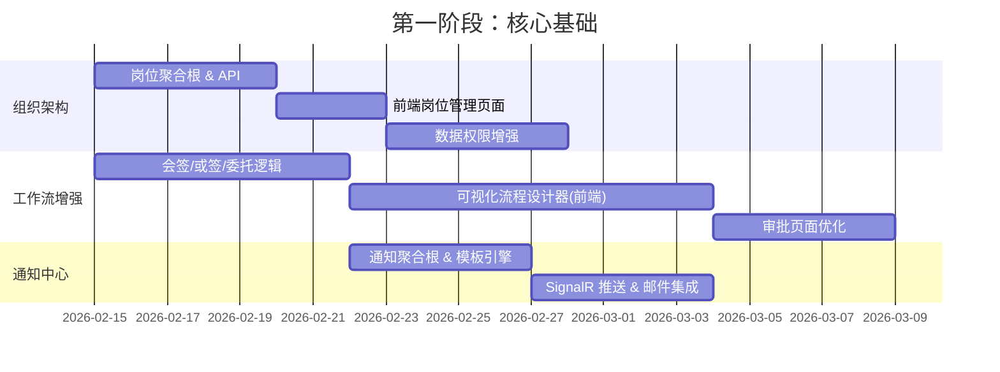

# OA 办公自动化系统 — 功能模块规划与实施路线图

> 基于 **Ncp.Admin** 项目（NetCorePal Cloud + DDD + FastEndpoints + Vben Admin）为 ~100 人企业构建 OA 系统

---

## 一、现有基础设施分析

| 层 | 技术栈 | 已有能力 |
|---|---|---|
| **后端框架** | .NET 8 + FastEndpoints + MediatR | API + CQRS + 领域事件 |
| **数据库** | EF Core + MySQL | ORM + 迁移 |
| **缓存/锁** | Redis + StackExchange.Redis | 分布式缓存/锁 |
| **消息队列** | RabbitMQ + CAP | 集成事件 / 最终一致性 |
| **定时任务** | Hangfire (Redis) | 后台作业 |
| **实时通信** | SignalR (`ChatHub`) | WebSocket |
| **认证授权** | JWT + RBAC | 用户/角色/权限 |
| **前端** | Vben Admin (Vue 3 + Ant Design Vue) | 管理后台框架 |
| **编排** | .NET Aspire | 服务发现/可观测性 |

### 已有领域模型

| 聚合根 | 功能 |
|---|---|
| `User` | 用户、角色分配、部门、刷新令牌 |
| `Role` + `RolePermission` | 角色与权限管理 |
| `Dept` | 树形部门结构 |
| `WorkflowDefinition` + `WorkflowNode` | 工作流定义、节点、版本管理 |
| `WorkflowInstance` | 工作流实例（审批流转） |

---

## 二、OA 功能模块规划（100 人规模）

按优先级分为 **4 个阶段**，每个阶段可独立上线：

### 🟢 第一阶段：核心基础（已有 + 完善）

> 目标：打通组织架构与审批基础流程

| 模块 | 说明 | 当前状态 |
|---|---|---|
| **1.1 组织架构管理** | 公司→部门→岗位→员工 树形结构 | ✅ 部门/用户已有，需增加「岗位」 |
| **1.2 权限管理** | 菜单权限 + 数据权限（部门级） | ✅ RBAC 已有，需增加数据权限 |
| **1.3 审批工作流引擎** | 可视化流程设计、多级审批、会签/或签、委托 | 🔶 基础定义/实例已有，需增强 |
| **1.4 通知中心** | 站内消息 + 邮件 + 微信/钉钉推送 | 🔶 SignalR 已接入，需扩展通知体系 |

---

### 🔵 第二阶段：日常办公

> 目标：覆盖 100 人公司最核心的日常办公场景

| 模块 | 说明 | 领域建模要点 |
|---|---|---|
| **2.1 考勤管理** | 打卡（GPS/WiFi）、排班、加班、出差 | `AttendanceRecord`, `Schedule`, `OvertimeRequest` |
| **2.2 请假管理** | 年假/事假/病假/调休，余额计算，审批集成 | `LeaveRequest`, `LeaveBalance` |
| **2.3 报销管理** | 费用申请、发票上传、报销审批、预算控制 | `ExpenseClaim`, `ExpenseItem`, `Budget` |
| **2.4 日程/会议管理** | 共享日历、会议室预订、参会通知 | `Calendar`, `MeetingRoom`, `MeetingBooking` |
| **2.5 公告管理** | 公司公告发布、已读/未读追踪 | `Announcement`, `ReadRecord` |

---

### 🟡 第三阶段：协作效率

> 目标：提升团队协作效率和知识沉淀

| 模块 | 说明 | 领域建模要点 |
|---|---|---|
| **3.1 任务管理** | 任务看板（类 Trello）、甘特图、进度跟踪 | `Project`, `Task`, `TaskComment` |
| **3.2 文档管理** | 文件上传/下载、版本控制、共享权限 | `Document`, `DocumentVersion`, `ShareLink` |
| **3.3 通讯录** | 企业通讯录、外部联系人管理 | `Contact`, `ContactGroup` |
| **3.4 即时通讯** | 单聊/群聊、消息历史、@提醒 | `ChatMessage`, `ChatGroup`（扩展现有 SignalR Hub） |

---

### 🟠 第四阶段：高级扩展

> 目标：数据驱动与外部集成

| 模块 | 说明 | 领域建模要点 |
|---|---|---|
| **4.1 合同管理** | 合同创建、审批、到期提醒、归档 | `Contract`, `ContractApproval` |
| **4.2 资产管理** | 固定资产登记、领用、归还、盘点 | `Asset`, `AssetAllocation` |
| **4.3 车辆管理** | 公司用车预约、调度 | `Vehicle`, `VehicleBooking` |
| **4.4 数据分析仪表盘** | 考勤统计、审批效率、费用报表 | 查询层聚合 |

---

## 三、分步实施路线图

### 阶段 1：核心基础（约 4-6 周）



每个模块的实施步骤均遵循以下 **DDD 标准开发流程**：

#### 以「考勤管理」模块为例的开发步骤：

**Step 1 — 领域层 (`Ncp.Admin.Domain`)**

```
AggregatesModel/
  AttendanceAggregate/
    Attendance.cs          ← 聚合根：打卡记录
    AttendanceSchedule.cs  ← 值对象/实体：排班
DomainEvents/
  AttendanceEvents/
    AttendanceCheckedInDomainEvent.cs
```

> 要点：强类型 ID (`AttendanceId : IInt64StronglyTypedId`)、私有 setter、领域事件

**Step 2 — 基础设施层 (`Ncp.Admin.Infrastructure`)**

```
EntityConfigurations/
  AttendanceEntityTypeConfiguration.cs  ← EF Core 映射
Repositories/
  AttendanceRepository.cs               ← 仓储实现
Migrations/
  <timestamp>_AddAttendance.cs          ← 数据库迁移
```

> 要点：执行 `dotnet ef migrations add AddAttendance`

**Step 3 — 应用层 (`Ncp.Admin.Web/Application`)**

```
Commands/
  AttendanceCommands/
    CheckInCommand.cs             ← MediatR 命令
    CheckInCommandHandler.cs      ← 命令处理器
    CheckInCommandValidator.cs    ← FluentValidation
Queries/
  AttendanceQuery.cs              ← 查询服务
```

**Step 4 — API 端点 (`Ncp.Admin.Web/Endpoints`)**

```
Endpoints/
  Attendance/
    CheckInEndpoint.cs            ← FastEndpoints
    GetAttendanceListEndpoint.cs
```

**Step 5 — 前端 (`src/frontend/apps/admin-antd/src`)**

```
api/
  attendance.ts                   ← API 调用
views/
  attendance/
    index.vue                     ← 列表页
    check-in.vue                  ← 打卡页
router/
  routes/modules/attendance.ts    ← 路由配置
```

**Step 6 — 测试**

```
test/
  Ncp.Admin.Web.Tests/
    AttendanceTests.cs            ← 集成测试
```

---

## 四、技术架构增强建议

### 4.1 文件存储服务（必须）

用于报销发票、文档管理、头像上传等：

```csharp
// 建议抽象接口
public interface IFileStorageService
{
    Task<string> UploadAsync(Stream stream, string fileName);
    Task<Stream> DownloadAsync(string fileKey);
    Task DeleteAsync(string fileKey);
}
```

可选方案：MinIO (自建) / 阿里云 OSS / 本地存储

### 4.2 通知抽象层（必须）

```csharp
public interface INotificationSender
{
    Task SendAsync(NotificationMessage message);
}
// 实现：SignalRNotificationSender, EmailNotificationSender, WeChatNotificationSender
```

### [NEW] Data Permission Filter Implementation

#### [MODIFY] [Role.cs](file:///d:/github/ncp/Ncp.Admin/src/Ncp.Admin.Domain/AggregatesModel/RoleAggregate/Role.cs)

Add `DataScope` property to `Role` entity to define the data access level:
- `All` (0): Can see all data in the system.
- `Dept` (1): Can see data belonging to their own department.
- `DeptAndSub` (2): Can see data belonging to their own department and all sub-departments.
- `Self` (3): Can only see data created by themselves.

#### [NEW] [IDataPermissionProvider.cs](file:///d:/github/ncp/Ncp.Admin/src/Ncp.Admin.Infrastructure/Services/IDataPermissionProvider.cs)

Define an interface to retrieve the current user's data permission context (highest DataScope from their roles, their DeptId, and their UserId).

#### [MODIFY] [ApplicationDbContext.cs](file:///d:/github/ncp/Ncp.Admin/src/Ncp.Admin.Infrastructure/ApplicationDbContext.cs)

Implement global query filters using `IDataPermissionProvider`.

---

### [NEW] File Storage Service

#### [NEW] [IFileStorageService.cs](file:///d:/github/ncp/Ncp.Admin/src/Ncp.Admin.Infrastructure/Services/IFileStorageService.cs)

Abstract interface for file operations to support multiple backends (MinIO, OSS, Local).

---

### [Component Name]

Summary of what will change in this component, separated by files. For specific files, Use [NEW] and [DELETE] to demarcate new and deleted files, for example:

#### [MODIFY] [file basename](file:///absolute/path/to/modifiedfile)
#### [NEW] [file basename](file:///absolute/path/to/newfile)
#### [DELETE] [file basename](file:///absolute/path/to/deletedfile)

## Verification Plan

| 阶段 | 新增表 | 估计数量 |
|---|---|---|
| Phase 1 | `positions`, `notifications`, `notification_templates` | 3 |
| Phase 2 | `attendance_records`, `schedules`, `leave_requests`, `leave_balances`, `expense_claims`, `expense_items`, `budgets`, `meeting_rooms`, `meeting_bookings`, `announcements`, `read_records` | 11 |
| Phase 3 | `projects`, `tasks`, `task_comments`, `documents`, `document_versions`, `contacts`, `chat_messages`, `chat_groups` | 8 |
| Phase 4 | `contracts`, `assets`, `asset_allocations`, `vehicles`, `vehicle_bookings` | 5 |

---

## 六、推荐的第一步行动

建议从 **阶段 1 的三个增强** 开始，按以下顺序：

1. **增加岗位管理** — 简单的 CRUD，练手 DDD 全流程
2. **通知中心** — 为后续所有审批流打基础 
3. **工作流增强** — 在现有 `WorkflowDefinition`/`WorkflowInstance` 上增加会签/委托

> [!TIP]
> 建议每完成一个模块就部署验证，采用**小步迭代**方式推进，避免一次性开发过多模块。

---

## 验证计划

由于这是规划文档，暂无代码变更。后续每个模块实施时将包含：

### 自动化测试
- 每个新领域模型编写单元测试（参考现有 `test/Ncp.Admin.Web.Tests`）
- 每个新 Endpoint 编写集成测试

### 手动验证
- 前端页面功能手动测试（CRUD、审批流转、通知接收等）
- 请用户在开发环境中验收每个阶段成果
